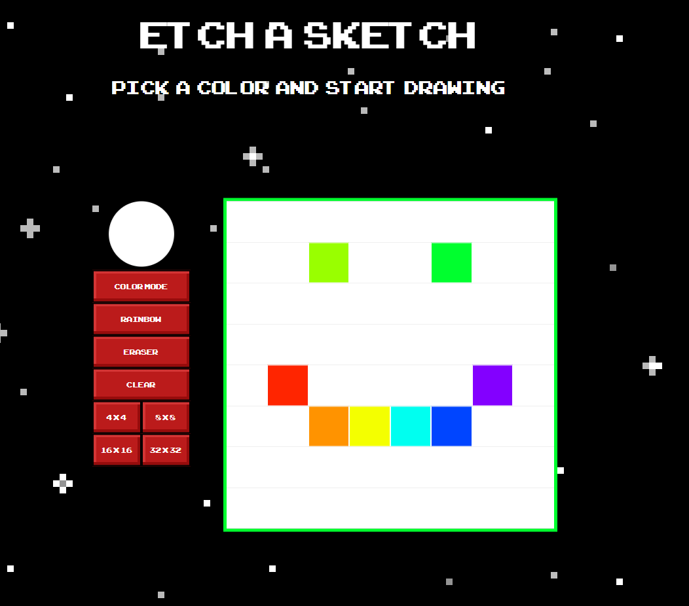

# odin-etch-a-sketch

JavaScript Foundations | "Project: Etch a Sketch" from "theodinproject.com"

## Etch a Sketch

  

## Etch a Sketch
A Etch a Sketch app lets you draw pixelated image by choosing canvas size, picking a color and hovering your mouse on canvas to draw.  
 
Created using JavaScript, HTML5 and SCSS for main styling

MIT © [Renaldas112]()

